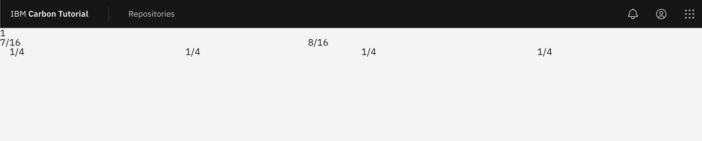
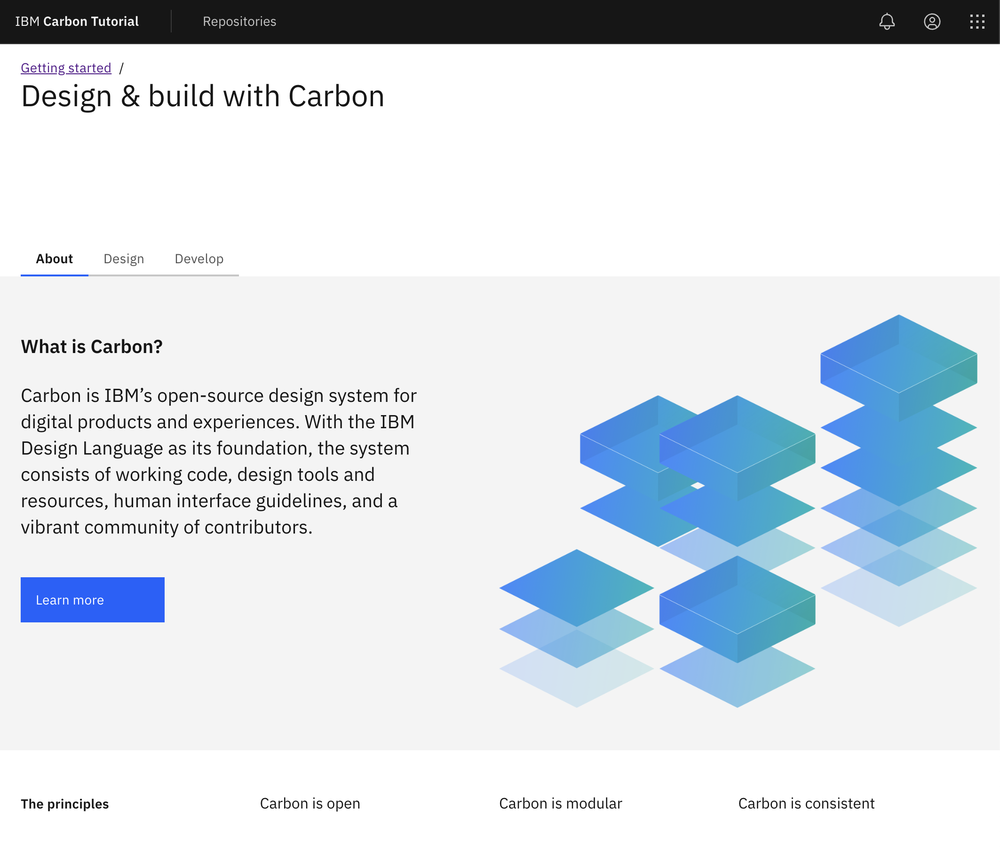
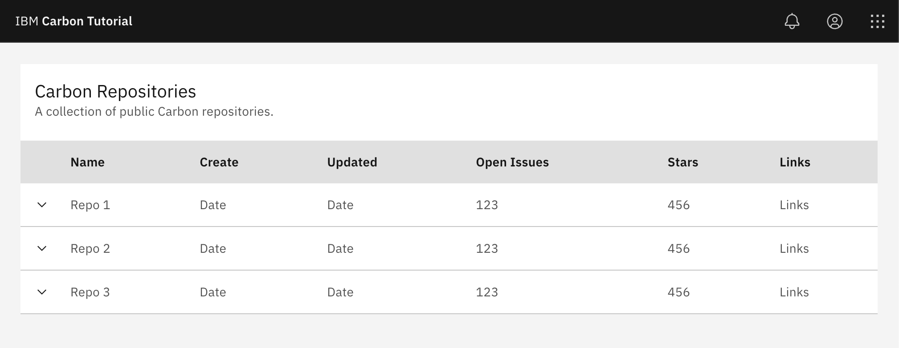

# Code along

This document will grow and document what we did along the way.

## Step 1

Starting from a base Create Next App, let’s install Carbon and begin using Carbon components. By the end you will have a Next.js app that uses the UI Shell to navigate between pages.

1.  Check it runs
    1. pnpm dev
    2. Stop it.
2.  Add SASS.
    1. Install SASS.
    2. Rename `style.css` to `style.scss` and rerun.
    3. Update `main.js` to import the scss file.
    4. Check it runs.
3.  Add Carbon

    1. `pnpm add @carbon/web-components @carbon/styles @carbon/icons`
    2. In `main.js`

       1. Import the Carbon button component.

          ```js
          import '@carbon/web-components/es/components/button/button.js';
          ```

       2. Delete imports for javascriptLogo, viteLogo and setupCounter and the files referred to.
       3. Delete everything else except the style and button import.

    3. In `style.scss` replace the contents with

       ```scss
       @use '@carbon/styles/scss/reset';
       @use '@carbon/styles/scss/theme' as *;
       @use '@carbon/styles/scss/themes';

       :root {
         @include theme(themes.$g10);
         background-color: $background;
         color: $text-primary;
       }
       ```

4.  In `index.html`

    1. Replace the contents of the `<body>` tag with

       ```html
       <div>
         Hello Carbon! Well, not quite yet. This is the starting point for the
         Carbon React tutorial.
       </div>
       ```

5.  A Carbon button in `index.html`

    1. Replace the body content again with

       ```html
       <cds-button class="button">Button</cds-button>
       <div><span>Count: </span><span class="count">0</span></div>
       ```

6.  Side quest... make the button do something

    1. In `main.js` add the following

       ```js
       export const increment = () => {
         const countEl = document.querySelector('.count');
         countEl.innerHTML = parseInt(countEl.innerText) + 1;
       };

       document.querySelector('.button').addEventListener('click', increment);
       ```

    2. A little bit of lit.

       1. Install `pnpm add lit`
       2. In `main.js` add the following import.

          ```js
          import { LitElement, html } from 'lit';
          ```

          Then replace the increment function with

          ```js
          export class MyCount extends LitElement {
            static properties = {
              count: { attribute: true, type: Number },
            };

            constructor() {
              super();
              this.count = this.count ?? 0;
            }

            render() {
              return html`<div>
                <span>Count: </span>
                <span class="count">${this.count}</span>
              </div>`;
            }
          }
          customElements.define('my-count', MyCount);

          export const increment = () => {
            const countEl = document.querySelector('.count');
            countEl.count += 1;
          };
          ```

       3. Then in `index.html` replace the counter and surrounding div with

          ```html
          <my-count class="count" count="100" />
          ```

7.  Next we add UI shell

    1. In `main.js` import the UIShell components using `import '@carbon/web-components/es/components/ui-shell/index';`
    2. An example of UIShell usage can be found here in the Web Components Storybook [https://web-components.carbondesignsystem.com/?path=/docs/components-ui-shell--header-base](https://web-components.carbondesignsystem.com/?path=/docs/components-ui-shell--header-base)
    3. Modify `index.html` first wrapping the contents of body with `<main class="main">...</main>`.
    4. Add the classes `<body class="app g10">` to the body tag.
    5. Then add the following `cds-header` before `main`

       ```html
       <header>
         <cds-header class="g100">
           <cds-header-name href="/" prefix="IBM"
             >Carbon Tutorial</cds-header-name
           >
         </cds-header>
       </header>
       ```

8.  Replacing the the `:root` CSS with the following in `style.scss`

    ```scss
    .app {
      display: grid;
      grid-template-rows: 3rem 1fr;
      height: 100vh;
      overflow: hidden;
    }

    .g10 {
      @include theme(themes.$g10);
      background-color: $background;
      color: $text-primary;
    }

    .g100 {
      @include theme(themes.$g100);

      background-color: $background;
      color: $text-primary;
    }
    ```

9.  Add a new page to the menu.

    1. After the `<cd-header-name>` tag add

       ```html
       <cds-header-nav menu-bar-label="Carbon Tutorial">
         <cds-header-nav-item href="./repositories.html"
           >Repositories</cds-header-nav-item
         >
       </cds-header-nav>
       ```

    2. Next duplicate `index.html` and name it `repositories.html`.
    3. Replace the contents of the `main` tag with the wordS `REPOSITORIES PAGE`.
    4. Give it a try

10. To complete step 1 of the tutorial, and before a `Lit`tle refactor we add the global actions to the header. 1. While we could copy the SVG files directly into our source we will instead create a simple Icon components in `main.js` utilizing icon functions exported with Carbon Web Components.

    1.  First import the following icons

        ```js
        import Notification20 from '@carbon/web-components/es/icons/notification/20.js';
        import UserAvatar20 from '@carbon/web-components/es/icons/user--avatar/20.js';
        import Switcher20 from '@carbon/web-components/es/icons/switcher/20.js';
        ```

    2.  Then create the add the following Icon component.

        ```js
        export class MyIcon extends LitElement {
          static properties = {
            icon: { attribute: true, type: String },
          };

          render() {
            return (
              { Notification20, UserAvatar20, Switcher20 }[this.icon] ??
              Notification20
            )();
          }
        }
        customElements.define('my-icon', MyIcon);
        ```

    3.  NOTE: It may not be the most efficient strategy to include large numbers of icons in one component.
    4.  In both`index.html`and`repositories.html` add the following to include the global actions. Note that at the time of writing `<cds-global-header>` did not appear to exist as a component.

        ```html
        <div class="cds--header__global">
          <cds-header-global-action
            aria-label="Notifications"
            class="action-icons"
          >
            <my-icon slot="icon" icon="Notification20" />
          </cds-header-global-action>
          <cds-header-global-action
            aria-label="User Avatar"
            class="action-icons"
          >
            <my-icon slot="icon" icon="UserAvatar20" />
          </cds-header-global-action>
          <cds-header-global-action
            aria-label="App Switcher"
            class="action-icons"
          >
            <my-icon slot="icon" icon="Switcher20" />
          </cds-header-global-action>
        </div>
        ```

## Step 1 plus - A `Lit`tle refactor

At this point, reviewing `index.html`, we can see that it is possible to use Web Components, Carbon and our own, directly in HTML as the work like native elements. This means that if we wanted we could use them inside React, Angular, Vue etc.

Working is relative, one glitch of note, is that we are using two pages with an obvious re-render between the two.

Rather than import one of these packages, let's continue and refactor using `Lit`.

1. First let's extract existing components from `main.js`.
   1. Extract `<my-count>`
      1. Create a new file `./components/my-count.js`.
      2. Add imports for Lit imports `import { LitElement, html } from 'lit';` at the top of the file.
      3. Move the `MyCount` class and associated `customElements.define` there.
      4. Create `./components/index.js` and add `import './my-count';`
      5. In `main.js` import the components folder with `import './components';`
      6. At this point the application should run and the counter still work.
   2. Now extract `<my-icon>`
      1. Create a new file `./components/my-icon.js`.
      2. Add imports for Lit imports `import { LitElement, html } from 'lit';` at the top of the file.
      3. Move the icon imports, `MyIcon` class and associated `customElements.define` there.
      4. In `./components/index.js` and add `import './my-icon';`
      5. At this point the application should run and the counter still work.
2. Next let's create a new component `tutorial-header`.

   1. Create a new file `./components/tutorial-header.js`.
   2. Add the following component starter code, either using the VSCode snippet or manually.

      ```js
      import { LitElement, html } from 'lit';

      export class TutorialHeader extends LitElement {
        render() {
          return html``;
        }
      }
      customElements.define('tutorial-header', TutorialHeader);
      ```

   3. Move the contents of the `<header>` tag in `index.html` inside the `html` template literal.
   4. In `./components/index.js` and add `import './tutorial-header';`
   5. Inside the now empty `<header>` tag in `index.html` add

      ```html
      <tutorial-header class="g100"></tutorial-header>
      ```

   6. `class="g100"` class can be removed from `./components/tutorial-header.js`.
   7. If you ar running the app it should still be working correctly.

3. Still in `tutorial-header.js` we can refactor to reduce repetition and simplify.

   1. Copy the icon imports from `my-icon.js`
   2. Add our global actions to the constructor in `tutorial-header.js`

      ```js
          constructor() {
            super();
            this.globalActions = [{
                icon: Notification20,
                label: 'Notifications',
            }, {
                icon: UserAvatar20,
                label: "User avatar"
            }, {
                icon: Switcher20,
                label: 'Switcher'
            }];
        }
      ```

   3. Then replace all the existing `<cds-header-global-actions>` and replace with the following.

   ```js
      ${this.globalActions.map((action => html`
        <cds-header-global-action
          aria-label="${action.href}"
          class="action-icons"
          >
          ${action.icon({slot: 'icon'})}
        </cds-header-global-action>
      `))}
   ```

   NOTE: Lit, like other reactive packages uses familiar javascript methods to render content from data.

   4. This small refactor, while not necessary does serve to show that Lit can be used to construct HTML from data. It also removes he current need for the `my-icon` component, but we'll keep it for reference and possible use later.

4. Creating and using `page-landing` and `page-repositories` components.

   1. Create the files `./components/page-landing.js` and `./components/page-repositories.js`
   2. Using the code snippet or by copying the following add the shell of a component to each.

      ```js
      // page-landing.js
      import { LitElement, html } from 'lit';

      export class PageLanding extends LitElement {
        render() {
          return html``;
        }
      }
      customElements.define('page-landing', PageLanding);
      ```

      ```js
      // page-repositories.js
      import { LitElement, html } from 'lit';

      export class PageRepositories extends LitElement {
        render() {
          return html``;
        }
      }
      customElements.define('page-repositories', PageRepositories);
      ```

   3. In `./components/page-repositories.js` simply add the following in the template literal

      ```html
      <div class="page--repositories">REPOSITORIES PAGE component</div>
      ```

   4. In `./components/page-landing.js` we first need to update the contents of the template literal to.

      ```HTML
      <div class="page--landing">
        <cds-button class="button" @click="${this.increment}"
          >Button</cds-button>
        <my-count class="count" count="3"></my-count>
        <div>LANDING PAGE component</div>
      </div>
      ```

   5. Then add the increment function.

      ```js
      increment = () => {
        const countEl = this.shadowRoot.querySelector('.count');
        countEl.count += 1;
      };
      ```

   6. Note that the increment function has changed from `document.querySelector` to `this.shadowRoot.querySelector` to access the components DOM.
   7. Add both components to `./components/index.js`;
   8. In `index.html` replace the contents of `<main>` with

      ```html
      <page-landing></page-landing>
      ```

   9. Now our App is sort of working but the Repositories page is not correct. This is most obvious if we now delete `repositories.html`.

5. At this point `main.js` can be reduced down to this as it is serving only to register components and import styles.

   ```js
   import './style.scss';
   import '@carbon/web-components/es/components/button/button.js';
   import '@carbon/web-components/es/components/ui-shell/index';
   import './components';
   ```

   1. If you're `main.js` does not look like this then adjust it to match.

6. Creating `./components/tutorial-app.js`.

   1. Add or generate the the `tutorial-app` component shell.

      ```js
      import { LitElement, html } from 'lit';

      export class TutorialApp extends LitElement {
        render() {
          return html``;
        }
      }
      customElements.define('tutorial-app', TutorialApp);
      ```

   2. Move the contents of our app from `index.html` to the template literal.

      ```html
      <div class="app g10">
        <header>
          <tutorial-header class="g100"></tutorial-header>
        </header>

        <main>
          <page-landing></page-landing>
        </main>
      </div>
      ```

   3. In `index.html` remove the classes from body and replace the contents with

      ```html
      <tutorial-app></tutorial-app>
      ```

   4. Import `tutorial-app` into `./components/index.js`
   5. If you are looking at the app, we appear to have broken the styling. This is because we have just moved our App into the shadow DOM.

      1. Create `./components/tutorial-app.scss` and copy the contents of `style.scss`
      2. Reduce `style.css` to just the reset line.
      3. Wrap all the selectors in `./components/tutorial-app.scss` with a `:host` selector to give.

         ```scss
         :host(tutorial-app) {
           .app {
             display: grid;
             grid-template-rows: 3rem 1fr;
             height: 100vh;
             overflow: hidden;
           }

           .g10 {
             @include theme(themes.$g10);
             background-color: $background;
             color: $text-primary;
           }

           .g100 {
             @include theme(themes.$g100);

             background-color: $background;
             color: $text-primary;
           }
         }
         ```

      4. Import this file into `./components/tutorial-app.js` using this line. A different approach may be required when not using Vite.

         ```js
         import styles from './tutorial-app.scss?inline';
         ```

      5. Add the following lines to the TutorialApp class. There may again be better ways to do this, but pressing on...

         ```js
         static get styles() {
           return [unsafeCSS(styles)];
         }
         ```

      6. DON'T FORGET TO IMPORT unsafeCSS
      7. The application styling should now look correct again.

   6. Finally we need to fix our routing.

      1. Inside the render function of `tutorial-app.js` add the following to read the path and select the appropriate main content.

         ```js
         const path = window.location.pathname;
         let page;

         switch (path) {
           case '/repositories.html':
           case '/repositories':
             page = html`<page-repositories></page-repositories>`;
             break;
           default:
             if (path !== '/') {
               window.history.replaceState({}, '', '/');
             }
             page = html`<page-landing></page-landing>`;
             break;
         }
         ```

      2. Then replace `<page-landing></page-landing>` in the template literal with `${page}`.
      3. Note that in `tutorial-header.js` we can now replace `repositories.html` with `repositories` making our URL a little neater.
      4. Delete `repositories.html` otherwise it interferes

7. Hopefully at this point you have a working application that looks something like this.
   
   
8. You might also notice that our header no longer flickers when we change pages.
9. Before we go, one last task in `index.html`
   1. Replace `Vite App` with `Carbon Tutorial`
   2. Add `<meta name="description" content="Carbon Tutorial using Web Components">`
   3. Replace `vite.svg` with `carbon.svg`
10. All looks good? Save your work and switch to the branch `step-2`.

## Step 2

Now that we have our app using the UI Shell, it’s time to build a few static pages. In this step, we’ll become comfortable with the Carbon grid and various Carbon components.

1.  Add a sample grid

    1. In `./components/page-landing.js` paste in this example grid usage.

       ```html
       <div class="${gridClasses({ class: 'page--landing', fullWidth: true })}">
         <div
           class="${colClasses({ class: 'page--landing__banner', sizes: { sm: 4, md: 8, lg:  16 } } ) }"
         >
           1
         </div>
         <div
           class="${colClasses({ class: 'page--landing__r2', sizes: { sm: 4, md: 8, lg: 16 } } ) }"
         >
           <div class="${gridClasses({ sub: true, wide: true } ) }">
             <div
               class="${colClasses({ class: 'page--landing__tab-content', sizes: { sm: 4, md: 4, lg: 7 } } ) }"
             >
               7/16
             </div>
             <div class="${colClasses({ sizes: { sm:4, md: 4, lg: 7 } } ) }">
               8/16
             </div>
           </div>
         </div>
         <div
           class="${colClasses({ class: 'page--landing__r3', sizes: { sm: 4, md: 8, lg: 16 } } ) }"
         >
           <div class="${gridClasses({ sub: true, wide: true })}">
             <div
               class="${colClasses({ class: 'page--landing__label', sizes: { sm: 4, md: 2, lg: 4 } } ) }"
             >
               1/4
             </div>
             <div
               class="${colClasses({ class: 'page--landing__title', sizes: { sm: 4, md: 2, lg: 4 } } ) }"
             >
               1/4
             </div>
             <div
               class="${colClasses({ class: 'page--landing__title', sizes: { sm: 4, md: 2, lg: 4 } } ) }"
             >
               1/4
             </div>
             <div
               class="${colClasses({ class: 'page--landing__title', sizes: { sm: 4, md: 2, lg: 4 } } ) }"
             >
               1/4
             </div>
           </div>
         </div>
       </div>
       ```

    2. The eagle eyed amongst you will notice that this is not using Carbon Web Components. While feature parity in Carbon Web Components is improving all the time, there are some features not yet available. Grid is the most notable gap at this time.
    3. Then import for the utility functions `colClasses` and `gridClasses`.

       ```js
       import { colClasses, gridClasses } from '../utils/grid';
       ```

    4. The page should now run but is missing the required grid styling. Create `./components/page-landing.scss` and paste the following into it.

       ```scss
       @use '@carbon/styles/scss/grid';

       :host(page-landing) {
         @include grid.css-grid();

         .cds--css-grid {
           padding-left: 20px;
           padding-right: 20px;
           box-sizing: border-box;
         }
       }
       ```

    5. Import the style file into `./components/page-landing.js` and add the styles just before the end of the class as before.

       ```js
       import styles from './page-landing.scss';
       ```

       ```js
         static get styles() {
           return [unsafeCSS(styles)];
         }
       ```

    6. Your landing page should now look something like this.

    

2.  Adding the tutorial grid content.

    1. First in `main.js` add the following imports which we will be using in this section.

       ```js
       import '@carbon/web-components/es/components/breadcrumb/index';
       import '@carbon/web-components/es/components/tabs/index';
       ```

    2. Inside the first column element `class: 'page--landing__banner'` add the following breadcrumb and heading.

       ```html
       <cds-breadcrumb noTrailingSlash aria-label="Page navigation">
         <cds-breadcrumb-item>
           <a href="/">Getting started</a>
         </cds-breadcrumb-item>
       </cds-breadcrumb>
       <h1 class="page--landing__heading">Design &amp; build with Carbon</h1>
       ```

    3. In the second column element `class: 'page--landing__r2'` before the sub grid which will contain our tab panels we place the tabs.

       ```html
       <cds-tabs value="about">
         <cds-tab id="tab-about" value="about" target="panel-about"
           >About</cds-tab
         >
         <cds-tab id="tab-design" value="design" target="panel-design"
           >Design</cds-tab
         >
         <cds-tab id="tab-develop" value="develop" target="panel-develop"
           >Develop</cds-tab
         >
       </cds-tabs>
       ```

    4. Next up we need to define the tab panel contents in `./components/page-landing.js`.

       1. First wrap the grid element immediately after `</cds-tabs>` with our tab panel.

          ```html
          <div id="panel-about" role="tabpanel" aria-labelledby="tab-about">
            ... grid element is here
          </div>
          ```

       2. Then replace the contents of the contained columns with.

          ```html
          <h3 class="page--landing__subheading">What is Carbon?</h3>
          <p class="page--landing__p">
            Carbon is IBM’s open-source design system for digital products and
            experiences. With the IBM Design Language as its foundation, the
            system consists of working code, design tools and resources, human
            interface guidelines, and a vibrant community of contributors.
          </p>
          <cds-button>Learn more</cds-button>
          ```

       3. And

          ```html
          
          ```

       4. After the first tab panel we need to add two further panels `Design`.

          ```html
          <div id="panel-design" role="tabpanel" aria-labelledby="tab-design">
            <div
              class="${gridClasses({
                sub: true,
                wide: true,
              })}"
            >
              <div
                class="${colClasses({
                  class: 'page--landing__tab-content',
                  sizes: { sm: 4, md: 8, lg: 16 },
                })}"
              >
                <p class="page--landing__p">
                  Rapidly build beautiful and accessible experiences. The Carbon
                  kit contains all resources you need to get started.
                </p>
              </div>
            </div>
          </div>
          ```

       5. And `Develop`

          ```html
          <div id="panel-develop" role="tabpanel" aria-labelledby="tab-develop">
            <div
              class="${gridClasses({
               sub: true,
               wide: true,
             })}"
            >
              <div
                class="${colClasses({
                 class: 'page--landing__tab-content',
                 sizes: { sm: 4, md: 8, lg: 16 },
               })}"
              >
                <p class="page--landing__p">
                  Carbon provides styles and components in Vanilla, React,
                  Angular, and Vue for anyone building on the web.
                </p>
              </div>
            </div>
          </div>
          ```

    5. At this point we have something functional, but in need of a little styling. Head to `./contents/page-landing.scss`.

       1. Tidy up by adding Carbon theme and spacing imports.

          ```scss
          @use '@carbon/styles/scss/spacing' as *;
          @use '@carbon/styles/scss/theme' as *;
          @use '@carbon/styles/scss/type' as *;
          ```

       2. Then change `20px` in `.cds--css-grid` to `$spacing-06` (24px).
       3. To style the content of the banner add this inside the `:host(page-landing)`

       ```scss
       .page--landing {
         height: 100%;
         overflow-y: auto;
       }

       .page--landing__banner {
         padding: $spacing-05 0 $spacing-07 * 4;
         background: $layer-01;
         box-shadow: $spacing-06 0 0 $layer-01, -1 * $spacing-06 0 0 $layer-01;
       }

       .page--landing__heading {
         @include type-style('productive-heading-05');

         margin: 0;
       }
       ```

       4. Style the tabs and content in the same place with

          ```scss
          .page--landing__illo {
            max-width: 100%;
            float: inline-end;
            height: auto;
          }

          @include breakpoint-down(md) {
            .page--landing__illo {
              max-width: 528px;
              width: 100%;
              height: 100%;
              float: inline-start;
            }
          }

          .page--landing__tabs {
            margin: -1 * $spacing-08 0 $spacing-08;
          }

          .page--landing__subheading {
            @include type-style('productive-heading-03');

            font-weight: 600;
          }

          .page--landing__p {
            @include type-style('productive-heading-03');
            margin-top: $spacing-06;
            margin-bottom: $spacing-08;
          }
          ```

    6. The final row of our grid needs populating.

       1. Replace each of the `1/4` with `The principles`, `Carbon is open`, `Carbon is modular`, `Carbon is consistent`.
       2. Next we need to adjust the column sizes as we want the contents to wrap on a medium size. The 2nd, 3rd and 4th columns should use the following.

          ```js
            sizes: {
                sm: 4,
                md: { span: 6, offset: 2 },
                lg: { span: 4, offset: 4 },
              }
          ```

          ```js
            sizes: {
                sm: 4,
                md: { span: 6, offset: 2 },
                lg: { span: 4, offset: 8 },
              }
          ```

          ```js
            sizes: {
                sm: 4,
                md: { span: 6, offset: 2 },
                lg: { span: 4, offset: 12 },
              }
          ```

       3. The medium offset forces us to specify an offset at the large size. If you give this a try in the browser you should see these columns wrap when the screen reaches medium size.
       4. To finish up our landing page we need to add a little more to `./components/page-landing.scss` inside the `:host` definition.

          ```scss
          .page--landing__r3 {
            height: 100%;
            padding: $spacing-09 0;
            box-sizing: border-box;
            background: $layer-01;
            box-shadow: $spacing-06 0 0 $layer-01, -1 * $spacing-06 0 0
                $layer-01;
          }

          .page--landing__label {
            @include type-style('productive-heading-01');

            @include breakpoint-down(md) {
              padding-bottom: $spacing-06;
            }
          }
          ```

    7. Step 2 for the landing page is now complete and should look like this.
       

3.  Updating the repositories page.

    1. In `main.js` import the Carbon data table.

       ```js
       import '@carbon/web-components/es/components/data-table/index.js';
       ```

    2. In `./components/page-repositories.js` we will be rendering the content from data and using the utilities previously defined. Before the class declaration add the following.

       ```js
       import { colClasses, gridClasses } from '../utils/grid';

       const headings = [
         'Name',
         'Create',
         'Updated',
         'Open Issues',
         'Stars',
         'Links',
       ];
       const data = [
         {
           name: 'Repo 1',
           created: 'Date',
           updated: 'Date',
           openIssues: 123,
           stars: 456,
           links: 'Links',
           expansion: 'Row description',
         },
         {
           name: 'Repo 2',
           created: 'Date',
           updated: 'Date',
           openIssues: 123,
           stars: 456,
           links: 'Links',
           expansion: 'Row description',
         },
         {
           name: 'Repo 3',
           created: 'Date',
           updated: 'Date',
           openIssues: 123,
           stars: 456,
           links: 'Links',
           expansion: 'Row description',
         },
       ];
       ```

    3. Next replace the existing render with

       ```html
       <div
         class="${gridClasses({ class: 'page--repositories', fullWidth: true })}"
       >
         <div
           class="${colClasses({
             class: 'page--repositories__table',
             sizes: { sm: 4, md: 8, lg: 16 },
           })}"
         >
           REPOSITORIES PAGE component
         </div>
       </div>
       ```

    4. Now we can add our table, tackling the headers first.

       ```html
       <cds-table expandable>
         <cds-table-header-title slot="title"
           >Carbon Repositories</cds-table-header-title
         >
         <cds-table-header-description slot="description"
           >A collection of public Carbon
           repositories.</cds-table-header-description
         >
         <cds-table-head>
           <cds-table-header-row>
             ${headings.map( (heading) =>
             html`<cds-table-header-cell>${heading}</cds-table-header-cell>`, )}
           </cds-table-header-row>
         </cds-table-head></cds-table

       >
       <cds-table-body>Table body goes here</cds-table-body>
       </cds-table>
       ```

    5. Finally add the table body contents with the following.

       ```js
       ${data.map( (row) => html`<cds-table-row>
         ${Object.keys(row).map((key) => { const cell = row[key]; if (key !==
         'expansion') { return html`<cds-table-cell data-key="${key}"
           >${cell}</cds-table-cell
         >`; } })} </cds-table-row
       ><cds-table-expanded-row>${row.expansion}</cds-table-expanded-row>`, )}
       ```

    6. Next we need to add a little bit of styling, by creating and using `./components/page-repositories.scss`. Feel free to explore and understand the following CSS.

       ```scss
       @use '@carbon/styles/scss/grid';
       @use '@carbon/styles/scss/breakpoint' as *;
       @use '@carbon/styles/scss/spacing' as *;
       @use '@carbon/styles/scss/theme' as *;
       @use '@carbon/styles/scss/type' as *;

       :host(page-repositories) {
         .cds--css-grid {
           padding: $spacing-06;
           box-sizing: border-box;
         }

         .page--repositories {
           height: 100%;
           overflow-y: auto;
         }
       }
       ```

    7. In `./components/page-repositories.js` import and make use of the styles as seen previously by

       1. Importing `unsafeCSS`
       2. Importing `./components/page-repositories.scss`
       3. Using `unsafeCSS` to style the component with

       ```js
         static get styles() {
           return [unsafeCSS(styles)];
         }

       ```

    8. The table should now render as follows

    

## Step 2 - Grid Lit refactor

Before moving on we'll refactor and tidy away the grid and column HTML into Lit Web components.

1. First create the grid component.

   1. Create `./components/my-grid.js` and using the snippet or copying and pasting the following base component.

      ```js
      import { LitElement, html } from 'lit';

      export class MyGrid extends LitElement {
        render() {
          return html``;
        }
      }
      customElements.define('my-grid', MyGrid);
      ```

   2. Add these properties and constructor

      ```js
        static properties = {
          class: { type: String },
          fullWidth: { type: Boolean },
          sub: { type: Boolean },
          wide: { type: Boolean },
          shadowStyle: { type: String },
        };

        constructor() {
          super();
          this.class = this.class ?? '';
          this.fullWidth = this.fullWidth ?? false;
          this.sub = this.sub ?? false;
          this.wide = this.wide ?? false;
          this.shadowStyle = this.shadowStyle ?? '';
        }
      ```

   3. Import `gridClasses` from `./utils/grid.js`
   4. Replace the contents of the render function with the following. Which takes the properties supplied and applies them to the contents of the component.

      ```js
      const classes = gridClasses(this).join(' ');

      // Grid styling added to contained components, allowing CSS Grid
      // to affect the it's own slot content.
      return html`<div class="${classes}" style="${this.shadowStyle}">
        <slot></slot>
      </div> `;
      ```

   5. Create `./components/my-grid.scss` and add the following.

      ```scss
      @use '@carbon/styles/scss/grid';
      @use '@carbon/styles/scss/spacing' as *;

      :host(my-grid) {
        display: grid;

        .cds--css-grid {
          padding-left: $spacing-06;
          padding-right: $spacing-06;
          box-sizing: border-box;
        }
      }
      ```

   6. Import and makes use of it in `./components/my-grid.js` as per previous examples.

2. Next up the column component

   1. Create `./components/my-col.js` and using the snippet or copying and pasting the following base component.

      ```js
      import { LitElement, html } from 'lit';

      export class MyCol extends LitElement {
        render() {
          return html``;
        }
      }
      customElements.define('my-col', MyCol);
      ```

   2. Add these properties and constructor

      ```js
      static properties = {
        class: { type: String },
        sizes: { type: Object },
      };

      constructor() {
        super();
        this.class = this.class ?? '';
        this.sizes = this.sizes ?? undefined;
      }

      ```

   3. Import `colClasses` from `./utils/grid.js`.
   4. Then replace the render function with the following. This adds the column classes to the containing tag. This is to enable it to work with the CSS Grid correctly.

      ```js
      const classes = colClasses(this);

      // Add the classes to the container so they see the grid
      classes.forEach((val) => this.classList.add(val));

      return html`<slot></slot>`;
      ```

   5. Create `./components/my-col.scss` and add the following.

      ```scss
      @use '@carbon/styles/scss/grid';
      @use '@carbon/styles/scss/spacing' as *;

      :host(my-col) {
        display: block;
      }
      ```

   NOTE: The display block here allows us to size the column component correctly.

3. Import and makes use of it in `./components/my-col.js` as per previous examples.

4. Add `my-grid` and `my-col` components to `./components/index.js`
5. Update `./components/page-repositories.js`

   1. Remove the `colClasses` and `gridClasses` imports.
   2. Replace the outer div with

      ```html
      <my-grid class="page--repositories" fullWidth> ... </my-grid>
      ```

   3. Replace the column divs with use of my-col with

      ```html
      <my-col
        class="page--repositories__table"
        .sizes="${{ sm: 4, md: 8, lg: 16 }}"
      >
        ...
      </my-col>
      ```

6. A small adjustment to `./components/page-repositories.scss` removes the `.cds--css-grid` selector and adds the following to the `.page--repositories` selector.

   ```scss
   padding: $spacing-06 0;
   box-sizing: border-box;
   ```

7. Update `./components/page-landing.js`

   1. Remove the `colClasses` and `gridClasses` imports.
   2. Replace each of the five divs where `girdClasses` is used with `my-grid`

      1. For example

      ```html
      <div
        class="${gridClasses({ class: 'page--landing', fullWidth: true })}"
      ></div>
      ```

      becomes

      ```html
      <my-grid
        class="page--landing"
        fullWidth
        shadowStyle="grid-template-rows: auto 1fr auto"
      ></my-grid>
      ```

      NOTE: The outer grid is the only grid where we pass `shadowStyle` this is used to size the three rows vertically. This can't be done from outside of the location the CSS grid is applied.

      NOTE 2: Boolean parameters like `fullWidth` do not need a value to be passed.

   3. Replace each of the eleven divs where `colClasses` is used with `my-col`.

      1. For example using the following regular expression

      ```regex
      <div[\s\n]+class="\$\{colClasses\(\{[^:]*class: ([^,]+),[^:]*sizes: ([^)]*\}),[^)]*\)\}"[^>]+>
      ```

      replacing with

      ```regex
      <my-col class=$1 .sizes="${$2}">
      ```

      NOTE: This updates nine of the opening tags, leaving two to tackle manually.

      NOTE 2: The size attribute is passing an object and makes use of the `.attr="${obj}"` syntax.

      2. Manually extracting `class: 'xyx'` and `size: obj` to

      ```html
      <my-col class="xyz" .size="${obj}"> ... </my-col>
      ```

   4. It may take more than one attempt to make sure you match each opening and closing div successfully. Note only three divs should remain.

8. In `./components/page-landing.scss` you can remove

   ```scss
   @include grid.css-grid();

   .cds--css-grid {
     padding-left: $spacing-06;
     padding-right: $spacing-06;
     box-sizing: border-box;
   }
   ```

9. If all has gone well you should now be able to run your application, with the same results before this Lit refactor.

## Step 3

This step we populate the repositories page with real data.

1. Add `octokit` to the dependencies.

```sh
pnpm add @octokit/core
```

2. Create a new link list component.

   1. Add link to the list of Carbon components in `./main.js`

   ```js
   import '@carbon/web-components/es/components/link/index';
   ```

   2. Create `./components/link-list.js` and generate a new component.
   3. Update to the following which renders a list our list of links.

      ```js
      import { LitElement, html, unsafeCSS } from 'lit';
      import styles from './link-list.scss?inline';

      export class LinkList extends LitElement {
        static properties = {
          url: String,
          homepage: String,
        };

        render() {
          return html`<ul class="link-list">
            <li><cds-link href="${this.url}">Github</cds-link></li>
            <li>
              <cds-link href="${this.homepage}">Homepage</cds-link>
            </li>
          </ul>`;
        }

        static get styles() {
          return [unsafeCSS(styles)];
        }
      }
      customElements.define('link-list', LinkList);
      ```

   4. Add `./components/link-list.scss` with the following styles

      ```scss
      @use '@carbon/styles/scss/spacing' as *;

      :host(link-list) {
        .link-list {
          display: flex;
          list-style: none;
          padding: 0;
        }

        .link-list li:not(:last-child) {
          padding-right: $spacing-02;

          &::after {
            content: '|';
            display: inline;
          }
        }

        .link-list li:not(:first-child) {
          padding-left: $spacing-02;
        }
      }
      ```

3. In `./components/page-repositories.js`

   1. Import Octokit and instantiate a new client.

      ```js
      import { Octokit } from '@octokit/core';

      const octokitClient = new Octokit({});
      ```

   2. Remove the hard coded data.
   3. Add the following constructor

      ```js
        constructor() {
          super();
          this.data = [];
          this.loading = true;
          this.error = null;
        }
      ```

   4. Add this function to fetch the data. The set requestUpdate nudges Lit to re-render as replacing `this.data` is not reactive.

      ```js
          async fetchData() {
            // this.data = [...data];
            const res = await octokitClient.request('GET /orgs/{org}/repos', {
              org: 'carbon-design-system',
              per_page: 75,
              sort: 'updated',
              direction: 'desc',
            });

            if (res.status === 200) {
              this.data = res.data.map((row) => ({
                name: row.name,
                created: new Date(row.created_at).toLocaleDateString(),
                updated: new Date(row.updated_at).toLocaleDateString(),
                openIssues: row.open_issues_count,
                stars: row.stargazers_count,
                links: { url: row.html_url, homepage: row.homepage },
                expansion: row.description,
              }));
              this.loading = false;
              this.requestUpdate();
            } else {
              console.log('Error obtaining repository data');
            }
          }
      ```

   5. Call the fetchData function from the `connectedCallback` lifecycle event.

      ```js
      connectedCallback() {
        super.connectedCallback();
        this.fetchData();
      }
      ```

   6. Making use of `this.loading` to render a table skeleton by wrapping the existing `cds-table` render with the following.

      ```js
        ${this.loading
          ? html`<cds-table-skeleton></cds-table-skeleton>`
          : html`EXISTING cds-table HTML`}
      ```

   7. Replace `data.map` with `this.data.map` and the table should render, if not quite correctly.
   8. The last step is to replace `${cell}` with the following to render our link-list.

      ```js
          ${key === 'links'
            ? html`<link-list
                homepage="${cell.homepage}"
                url="${cell.url}"
              >
              </link-list>`
            : cell}
      ```

4. Adding pagination

   1. Add the pagination component to the imports in `./main.js`
   2. In `./components/page-repositories.js` add two more state values to the constructor.

      ```js
      this.pageSize = 10;
      this.firstRowIndex = 0;
      ```

   3. Add methods to handle pagination change

      ```js
          handlePageSizeChange(val) {
            // Unfortunately not working
            // https://github.com/carbon-design-system/carbon/issues/17713
          }

          handlePagesChange({ detail }) {
            this.firstRowIndex = (detail.page - 1) * detail.pageSize;
            this.requestUpdate();
          }
      ```

   4. Where the data is being iterated over insert the following filter before the map.

      ```js
        this.data
          .filter(
            (v, i) =>
              i >= this.firstRowIndex &&
              i < this.firstRowIndex + this.pageSize,
          )
          .map(...
      ```

   5. Add the pagination after the closing `cds-table` tag.

      ```html
      <cds-pagination
        total-items="${this.data.length}"
        backward-text="Previous page"
        forward-text="Next page"
        itemsPerPageText="Items per page"
        @cds-pagination-changed-current="${this.handlePagesChange}"
        @cds-page-sizes-select-changed="${this.handlePageSizeChange}"
      >
        <cds-select-item value="10">10</cds-select-item>
        <cds-select-item value="20">20</cds-select-item>
        <cds-select-item value="30">30</cds-select-item>
        <cds-select-item value="40">40</cds-select-item>
        <cds-select-item value="50">50</cds-select-item>
      </cds-pagination>
      ```

   6. The table should now have pagination.

## Step 4

1. Add dependencies for `@carbon/pictograms`;

```
  pnpm @carbon/pictograms
```

2. Create info-card component

   1. Create the file `./components/info-card.js` and generate/create a new component as follows.

      ```js
      import { LitElement, html } from 'lit';

      export class InfoCard extends LitElement {
        render() {
          return html``;
        }
      }
      customElements.define('info-card', InfoCard);
      ```

   2. Add the following properties

      ```js
      static properties = {
        headingPart1: String,
        headingPart2: String,
        message: String,
      };
      ```

   3. Update the render function to return the following HTML which includes slots for the body and icon.

      ```html
      <div class="info-card">
        <div>
          <h4 class="info-card__heading">
            ${this.headingPart1}
            <strong>${this.headingPart2}</strong>
          </h4>
          <p class="info-card__body"><slot></slot></p>
        </div>
        <div class="info-card__icon">
          <slot name="icon"></slot>
        </div>
      </div>
      ```

   4. Add the component to `./components/index.js`.

3. Next we will adjust `./components/page-landing.js`

   1. Add the following imports for the pictograms and `unsafeSVG`.

      ```js
      import advocate from '@carbon/pictograms/svg/advocate.svg?raw';
      import accelerating from '@carbon/pictograms/svg/accelerating-transformation.svg?raw';
      import globe from '@carbon/pictograms/svg/globe.svg?raw';
      import { unsafeSVG } from 'lit/directives/unsafe-svg.js';
      ```

      NOTE: As per other `unsafe` imports this refers to allowing others to inject into your application. You should always take care to prevent that, in this tutorial it is not a concern.

   2. Add a constructor that reads the SVGs.

      ```js

        constructor() {
          super();

          this.advocate = unsafeSVG(advocate);
          this.accelerating = unsafeSVG(accelerating);
          this.globe = unsafeSVG(globe);
        }

      ```

   3. Next change the columns for `page--landing__r3` to cope with the new info cards. Replacing each of the `md: ...` values with `md: 6,`
   4. Carbon is open card

      ```html
      <info-card headingPart1="Carbon is" headingPart2="Open">
        It's a distributed effort, guided by the principles of the open-source
        movement. Carbon's users are also it's makers, and everyone is
        encouraged to contribute."

        <div slot="icon">${this.advocate}</div>
      </info-card>
      ```

   5. Carbon is modular card

      ```html
      <info-card headingPart1="Carbon is" headingPart2="Modular">
        Carbon's modularity ensures maximum flexibility in execution. It's
        components are designed to work seamlessly with each other, in whichever
        combination suits the needs of the user.

        <div slot="icon">${this.accelerating}</div>
      </info-card>
      ```

   6. Carbon is consistent card

      ```html
      <info-card headingPart1="Carbon is" headingPart2="Consistent">
        Based on the comprehensive IBM Design Language, every element and
        component of Carbon was designed from the ground up to work elegantly
        together to ensure consistent, cohesive user experiences.

        <div slot="icon">${this.globe}</div>
      </info-card>
      ```

   7. No styling has been applied to the `info-card` components yet, so it will run but look a bit funky.

4. Add `info-card` styling.

   1. Create `./components/info-card.scss` and add the following SCSS to style our component and ensure it behaves responsively. There should be nothing unexpected in this styling.

      ```scss
      @use '@carbon/styles/scss/spacing' as *;
      @use '@carbon/styles/scss/breakpoint' as *;
      @use '@carbon/styles/scss/theme' as *;
      @use '@carbon/styles/scss/type' as *;

      :host(info-card) {
        .info-card {
          display: flex;
          height: 300px;
          flex-direction: column;
          justify-content: space-between;
          padding-inline: $spacing-05;
          border-left: 1px solid $border-subtle;

          @include breakpoint-down(lg) {
            border-left: none;
            padding-inline: 0;
            padding-top: $spacing-11;
            height: initial;
          }
        }

        .info-card__heading {
          @include type-style('heading-03');

          margin-top: 0;
        }

        .info-card__body {
          @include type-style('body-long-01');
        }

        .info-card__icon {
          height: $spacing-10;
          width: $spacing-10;

          @include breakpoint-down(lg) {
            margin-top: $spacing-09;
          }
        }
      }
      ```

   2. Update `./components/info-card.js` to make use of the styles and you should now have a completed tutorial.

## Step 5

This tutorial is missing all manner of things that a good project should have.

- Testing
- Spell checker
- Script linting
- Style linting

Time constraints mean there is no step 5 to include them, not yet...

Feel free to submit a PR with the enhancements you think should be included.
