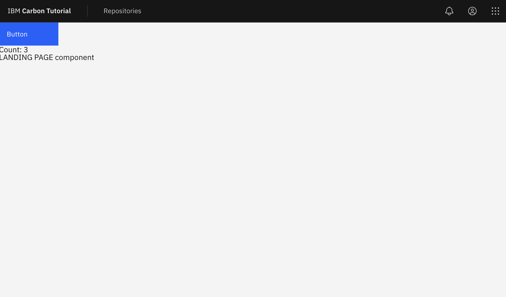
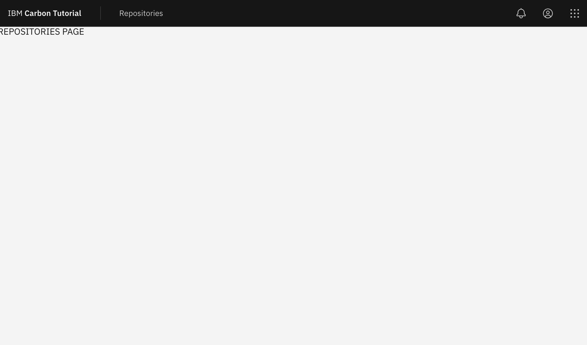

# Code along

This document will grow and document what we did along the way.

## Step 1

1.  Check it runs
    1. pnpm dev
    2. Stop it.
2.  Add SASS.
    1. Install SASS.
    2. Rename `style.css` to `style.scss` and rerun.
    3. Update `main.js` to import the scss file.
    4. Check it runs.
3.  Add Carbon

    1. pnpm add @carbon/web-components @carbon/styles @carbon/icons
    2. In `main.js`

       1. Import the Carbon button component.

          ```js
          import '@carbon/web-components/es/components/button/button.js';
          ```

       2. Delete imports for javascriptLogo, viteLogo and setupCounter and the files referred to.
       3. Delete everything else except the style and button import.

    3. In `style.scss` replace the contents with

       ```scss
       @use '@carbon/styles/scss/reset';
       @use '@carbon/styles/scss/theme' as *;
       @use '@carbon/styles/scss/themes';

       :root {
         @include theme(themes.$g10);
         background-color: $background;
         color: $text-primary;
       }
       ```

    4. Check it runs.

4.  In `index.html`

    1. Replace the contents of the `<body>` tag with

       ```html
       <div>
         Hello Carbon! Well, not quite yet. This is the starting point for the
         Carbon React tutorial.
       </div>
       ```

5.  A Carbon button in `index.html`

    1. Replace the body content again with

       ```html
       <cds-button class="button">Button</cds-button>
       <div><span>Count: </span><span class="count">0</span></div>
       ```

6.  Side quest... make the button do something

    1. In `main.js` add the following

       ```js
       export const increment = () => {
         const countEl = document.querySelector('.count');
         countEl.innerHTML = parseInt(countEl.innerText) + 1;
       };

       document.querySelector('.button').addEventListener('click', increment);
       ```

    2. A little bit of lit.

       1. Install `pnpm add lit`
       2. In `main.js` add the following import.

          ```js
          import { LitElement, html } from 'lit';
          ```

          Then replace the increment function with

          ```js
          export class MyCount extends LitElement {
            static properties = {
              count: { attribute: true, type: Number },
            };

            constructor() {
              super();
              this.count = this.count ?? 0;
            }

            render() {
              return html`<div>
                <span>Count: </span>
                <span class="count">${this.count}</span>
              </div>`;
            }
          }
          customElements.define('my-count', MyCount);

          export const increment = () => {
            const countEl = document.querySelector('.count');
            countEl.count += 1;
          };
          ```

       3. Then in `index.html` replace the counter and surrounding div with

          ```html
          <my-count class="count" count="100" />
          ```

7.  Next we add UI shell

    1. In `main.js` import the UIShell components using `import '@carbon/web-components/es/components/ui-shell/index';`
    2. An example of UIShell usage can be found here in the Web Components Storybook [https://web-components.carbondesignsystem.com/?path=/docs/components-ui-shell--header-base](https://web-components.carbondesignsystem.com/?path=/docs/components-ui-shell--header-base)
    3. Modify `index.html` first wrapping the contents of body with `<main class="main">...</main>`.
    4. Add the classes `<body class="app g10">` to the body tag.
    5. Then add the following `cds-header` before `main`

       ```html
       <header>
         <cds-header class="g100">
           <cds-header-name href="/" prefix="IBM"
             >Carbon Tutorial</cds-header-name
           >
         </cds-header>
       </header>
       ```

8.  Replacing the the `:root` CSS with the following in `style.scss`

    ```scss
    .app {
      display: grid;
      grid-template-rows: 3rem 1fr;
      height: 100vh;
      overflow: hidden;
    }

    .g10 {
      @include theme(themes.$g10);
      background-color: $background;
      color: $text-primary;
    }

    .g100 {
      @include theme(themes.$g100);

      background-color: $background;
      color: $text-primary;
    }
    ```

9.  Add a new page to the menu.

    1. After the `<cd-header-name>` tag add

       ```html
       <cds-header-nav menu-bar-label="Carbon Tutorial">
         <cds-header-nav-item href="./repositories.html"
           >Repositories</cds-header-nav-item
         >
       </cds-header-nav>
       ```

    2. Next duplicate `index.html` and name it `repositories.html`.
    3. Replace the contents of the `main` tag with the wordS `REPOSITORIES PAGE`.
    4. Give it a try

10. To complete step 1 of the tutorial, and before a `Lit`tle refactor we add the global actions to the header. 1. While we could copy the SVG files directly into our source we will instead create a simple Icon components in `main.js` utilizing icon functions exported with Carbon Web Components.

    1.  First import the following icons

        ```js
        import Notification20 from '@carbon/web-components/es/icons/notification/20.js';
        import UserAvatar20 from '@carbon/web-components/es/icons/user--avatar/20.js';
        import Switcher20 from '@carbon/web-components/es/icons/switcher/20.js';
        ```

    2.  Then create the add the following Icon component.

        ```js
        export class MyIcon extends LitElement {
          static properties = {
            icon: { attribute: true, type: String },
          };

          render() {
            return (
              { Notification20, UserAvatar20, Switcher20 }[this.icon] ??
              Notification20
            )();
          }
        }
        customElements.define('my-icon', MyIcon);
        ```

    3.  NOTE: It may not be the most efficient strategy to include large numbers of icons in one component.
    4.  In both`index.html`and`repositories.html` add the following to include the global actions. Note that at the time of writing `<cds-global-header>` did not appear to exist as a component.

        ```html
        <div class="cds--header__global">
          <cds-header-global-action
            aria-label="Notifications"
            class="action-icons"
          >
            <my-icon slot="icon" icon="Notification20" />
          </cds-header-global-action>
          <cds-header-global-action
            aria-label="User Avatar"
            class="action-icons"
          >
            <my-icon slot="icon" icon="UserAvatar20" />
          </cds-header-global-action>
          <cds-header-global-action
            aria-label="App Switcher"
            class="action-icons"
          >
            <my-icon slot="icon" icon="Switcher20" />
          </cds-header-global-action>
        </div>
        ```

## Step 1 plus - A `Lit`tle refactor

At this point, reviewing `index.html`, we can see that it is possible to use Web Components, Carbon and our own, directly in HTML as the work like native elements. This means that if we wanted we could use them inside React, Angular, Vue etc.

Working is relative, one glitch of note, is that we are using two pages with an obvious re-render between the two.

Rather than import one of these packages, let's continue and refactor using `Lit`.

1. First let's extract existing components from `main.js`.
   1. Extract `<my-count>`
      1. Create a new file `./components/my-count.js`.
      2. Add imports for Lit imports `import { LitElement, html } from 'lit';` at the top of the file.
      3. Move the `MyCount` class and associated `customElements.define` there.
      4. Create `./components/index.js` and add `import './my-count';`
      5. In `main.js` import the components folder with `import './components';`
      6. At this point the application should run and the counter still work.
   2. Now extract `<my-icon>`
      1. Create a new file `./components/my-icon.js`.
      2. Add imports for Lit imports `import { LitElement, html } from 'lit';` at the top of the file.
      3. Move the icon imports, `MyIcon` class and associated `customElements.define` there.
      4. In `./components/index.js` and add `import './my-icon';`
      5. At this point the application should run and the counter still work.
2. Next let's create a new component `tutorial-header`.

   1. Create a new file `./components/tutorial-header.js`.
   2. Add the following component starter code, either using the VSCode snippet or manually.

      ```js
      import { LitElement, html } from 'lit';

      export class TutorialHeader extends LitElement {
        render() {
          return html``;
        }
      }
      customElements.define('tutorial-header', TutorialHeader);
      ```

   3. Move the contents of the `<header>` tag in `index.html` inside the `html` template literal.
   4. In `./components/index.js` and add `import './tutorial-header';`
   5. Inside the now empty `<header>` tag in `index.html` add

      ```html
      <tutorial-header class="g100"></tutorial-header>
      ```

   6. `class="g100"` class can be removed from `./components/tutorial-header.js`.
   7. If you ar running the app it should still be working correctly.

3. Still in `tutorial-header.js` we can refactor to reduce repetition and simplify.

   1. Copy the icon imports from `my-icon.js`
   2. Add our global actions to the constructor in `tutorial-header.js`

      ```js
          constructor() {
            this.globalActions = [{
                icon: Notification20,
                label: 'Notifications',
            }, {
                icon: UserAvatar20,
                label: "User avatar"
            }, {
                icon: Switcher20,
                label: 'Switcher'
            }];
        }
      ```

   3. Then replace all the existing `<cds-header-global-actions>` and replace with the following.

   ```js
      ${this.globalActions.map((action => html`
        <cds-header-global-action
          aria-label="${action.href}"
          class="action-icons"
          >
          ${action.icon({slot: 'icon'})}
        </cds-header-global-action>
      `))}
   ```

   4. This small refactor, while not necessary does serve to show that Lit can be used to construct HTML from data. It also removes he current need for the `my-icon` component, but we'll keep it for reference and possible use later.

4. Creating and using `main-landing` and `main-repositories` components.

   1. Create the files `./components/main-landing.js` and `./components/main-repositories.js`
   2. Using the code snippet or by copying the following add the shell of a component to each.

      ```js
      // main-landing.js
      import { LitElement, html } from 'lit';

      export class MainLanding extends LitElement {
        render() {
          return html``;
        }
      }
      customElements.define('main-landing', MainLanding);
      ```

      ```js
      // main-repositories.js
      import { LitElement, html } from 'lit';

      export class MainRepositories extends LitElement {
        render() {
          return html``;
        }
      }
      customElements.define('main-repositories', MainRepositories);
      ```

   3. In `./components/main-repositories.js` simply add the following in the template literal

      ```html
      <div class="main--repositories">REPOSITORIES PAGE component</div>
      ```

   4. In `./components/main-landing.js` we first need to update the contents of the template literal to.

      ```HTML
      <main class="main--landing">
        <cds-button class="button" @click="${this.increment}"
          >Button</cds-button>
        <my-count class="count" count="3"></my-count>
        <div>LANDING PAGE component</div>
      </main>
      ```

   5. Then add the increment function.

      ```js
      increment = () => {
        const countEl = this.shadowRoot.querySelector('.count');
        countEl.count += 1;
      };
      ```

   6. Note that the increment function has changed from `document.querySelector` to `this.shadowRoot.querySelector` to access the components DOM.
   7. Add both components to `./components/index.js`;
   8. In `index.html` replace the contents of `<main>` with

      ```html
      <main-landing></main-landing>
      ```

   9. Now our App is sort of working but the Repositories page is not correct. This is most obvious if we now delete `repositories.html`.

5. At this point `main.js` can be reduced down to this as it is serving only to register components and import styles.

   ```js
   import './style.scss';
   import '@carbon/web-components/es/components/button/button.js';
   import '@carbon/web-components/es/components/ui-shell/index';
   import './components';
   ```

   1. If you're `main.js` does not look like this then adjust it to match.

6. Creating `./components/tutorial-app.js`.

   1. Add or generate the the `tutorial-app` component shell.

      ```js
      import { LitElement, html } from 'lit';

      export class TutorialApp extends LitElement {
        render() {
          return html``;
        }
      }
      customElements.define('tutorial-app', TutorialApp);
      ```

   2. Move the contents of our app from `index.html` to the template literal.

      ```html
      <div class="app g10">
        <header>
          <tutorial-header class="g100"></tutorial-header>
        </header>

        <main class="main">
          <main-landing></main-landing>
        </main>
      </div>
      ```

   3. In `index.html` remove the classes from body and replace the contents with

      ```html
      <tutorial-app></tutorial-app>
      ```

   4. Import `tutorial-app` into `./components/index.js`
   5. If you are looking at the app, we appear to have broken the styling. This is because we have just moved our App into the shadow DOM.

      1. Create `./components/tutorial-app.scss` and copy the contents of `style.scss`
      2. Reduce `style.css` to just the reset line.
      3. Wrap all the selectors in `./components/tutorial-app.scss` with a `:host` selector to give.

         ```scss
         :host(tutorial-app) {
           .app {
             display: grid;
             grid-template-rows: 3rem 1fr;
             height: 100vh;
             overflow: hidden;
           }

           .g10 {
             @include theme(themes.$g10);
             background-color: $background;
             color: $text-primary;
           }

           .g100 {
             @include theme(themes.$g100);

             background-color: $background;
             color: $text-primary;
           }
         }
         ```

      4. Import this file into `./components/tutorial-app.js` using this line. A differrent approach may be required when not using Vite.

         ```js
         import styles from './tutorial-app.scss?inline';
         ```

      5. Add the following lines to the TutorialApp class. There may again be better ways to do this, but pressing on...

         ```js
         static get styles() {
           return [unsafeCSS(styles)];
         }
         ```

      6. The application styling should now look correct again.

   6. Finally we need to fix our routing.

      1. Inside the render function of `tutorial-app.js` add the following to read the path and select the appropriate main.

         ```js
         const path = window.location.pathname;
         let main;

         switch (path) {
           case '/repositories.html':
           case '/repositories':
             main = html`<main-repositories></main-repositories>`;
             break;
           default:
             if (path !== '/') {
               window.history.replaceState({}, '', '/');
             }
             main = html`<main-landing></main-landing>`;
             break;
         }
         ```

      2. Then replace `<main-landing></main-landing>` in the template literal with `${main}`.
      3. Note that in `tutorial-header.js` we can now replace `repositories.html` with `repositories` making our URL a little neater.

7. Hopefully at this point you have a working application that looks something like this.
   
   
8. You might also notice that our header no longer flickers when we change pages.
9. Before we go, one last task in `index.html`
   1. Replace `Vite App` with `Carbon Tutorial`
   2. Add `<meta name="description" content="Carbon Tutorial using Web Components">`
   3. Replace `vite.svg` with `carbon.svg`
10. All looks good? Save your work and switch to the branch `step-2`.
