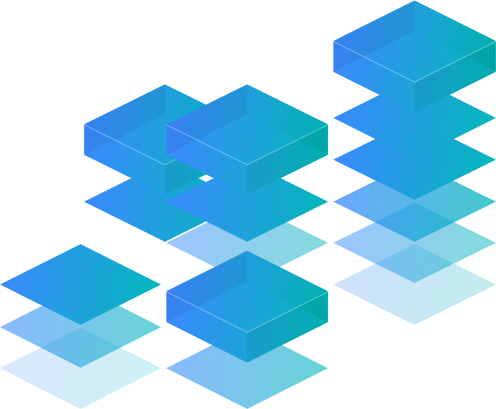

# Carbon tutorial - Web components

## Step 1

Using your favorite package installer or `yarn` as we will use here. Create a Vite app with Vanilla Javascript.

[Vite getting started](https://vite.dev/guide/#scaffolding-your-first-vite-project)

1.  Check it runs
    1. yarn dev
    2. Stop it.
2.  Add SASS.
    1. Install SASS `yarn sass`
    2. Rename `style.css` to `style.scss` and rerun.
    3. Update `main.js` to import the scss file.
    4. Check it runs.
3.  Add Carbon

    1. `yarn add @carbon/web-components @carbon/styles @carbon/icons`
    2. In `main.js`

       1. Import the Carbon button component.

          ```js
          import '@carbon/web-components/es/components/button/button.js';
          ```

       2. Delete imports for javascriptLogo, viteLogo and setupCounter and the files referred to.
       3. Delete everything else except the style and button import.

    3. In `style.scss` replace the contents with

       ```scss
       @use '@carbon/styles/scss/reset';
       @use '@carbon/styles/scss/theme' as *;
       @use '@carbon/styles/scss/themes';

       :root {
         @include theme(themes.$g10);

         @media (prefers-color-scheme: dark) {
           @include theme(themes.$g100);
         }
       }

       .g10 {
         @include theme(themes.$g10);
       }

       .g100 {
         @include theme(themes.$g100);
       }
       ```

4.  In `index.html`

    1. Replace the contents of the `<body>` tag with

       ```html
       <div>
         Hello Carbon! Well, not quite yet. This is the starting point for the
         Carbon Web Components tutorial.
       </div>
       ```

5.  A Carbon button in `index.html`

    1. Replace the body content again with

       ```html
       <cds-button class="button">Click more than once</cds-button>
       ```

6.  In `main.js` handle the button click adding.

    ```js
    const bodyEl = document.querySelector('body');

    // button click handler
    const handleClick = () => {
      bodyEl.classList.toggle('g10');
      bodyEl.classList.toggle('g100');
    };
    document.querySelector('.button').addEventListener('click', handleClick);

    // set initial theme based on preferences
    if (matchMedia('prefers-color-scheme').matches) {
      bodyEl.classList.add('g100');
    } else {
      bodyEl.classList.add('g10');
    }
    ```

7.  Now there's a bit more than the handler here the match media query is there to ensure `g10` or `g100` is initially set based on the users preferences.

## Step 1 part 2 UI Shell

1.  Adding the UI shell

    1. In `main.js` import the UIShell components using `';`
    2. An example of UIShell usage can be found here in the Web Components Storybook [https://web-components.carbondesignsystem.com/?path=/docs/components-ui-shell--header-base](https://web-components.carbondesignsystem.com/?path=/docs/components-ui-shell--header-base)
    3. Modify `index.html` first wrapping the contents of body with `<main class="main">...</main>`.
    4. Add the classes `<body class="app">` to the body tag.
    5. Then add the following `cds-header` before `main`

       ```html
       <header>
         <cds-header class="g100">
           <cds-header-name href="/" prefix="IBM"
             >Carbon Tutorial</cds-header-name
           >
         </cds-header>
       </header>
       ```

2.  Add the app layout CSS with the following in `style.scss`

    ```scss
    @use '@carbon/styles/scss/spacing' as *; // near top of file

    .app {
      display: grid;
      grid-template-rows: $spacing-09 1fr;
      height: 100vh;
      overflow: hidden;
    }

    .main {
      height: 100%;
      overflow-y: auto;
    }
    ```

3.  Add a new page to the menu.

    1. After the `<cd-header-name>` tag add

       ```html
       <cds-header-nav menu-bar-label="Carbon Tutorial">
         <cds-header-nav-item href="./repositories.html"
           >Repositories</cds-header-nav-item
         >
       </cds-header-nav>
       ```

    2. Next duplicate `index.html` and name it `repositories.html`.
    3. In this new file replace the contents of the `main` tag with the wordS `REPOSITORIES PAGE`.
    4. Give it a try
    5. Switching between pages might look a little glitchy, this is because it is a genuine page navigation, this is simply how HTML works. When using Web Components inside libraries such as Lit, React, Angular, Vue etc this is resolved by taking control of the routing. We will not investigate further here.

4.  Checking responsive behavior (wubdiw narrower than 1080px) you will notice the repositories page disappear from the menu. This goes into a sidebar controlled by a hamburger menu as follows.

    1. Before the `<cds-header-name>` tag add

       ```html
       <cds-header-menu-button
         button-label-active="Close menu"
         button-label-inactive="Open menu"
       ></cds-header-menu-button>
       ```

    2. Then after the closing `</cds-header-nav>` add

       ```html
       <cds-side-nav
         is-not-persistent
         aria-label="Side navigation"
         collapse-mode="${SIDE_NAV_COLLAPSE_MODE.RESPONSIVE}"
       >
         <cds-side-nav-items>
           <cds-side-nav-link href="./repositories.html">
             Repositories
           </cds-side-nav-link>
         </cds-side-nav-items>
       </cds-side-nav>
       ```

5.  Next we add global actions.

    1.  Rather than rely on the bundler to load Carbon SVG icons for us or add them inline, which can make our HTML harder to read, first add the following CSS to add refer directly to the icon files (which have been conveniently placed in the `./public` folder).

    Open `styles.scss` and add the following.

        ```scss
        .action-icon {
            width: 1.25rem;
            height: 1.25rem;
            background-color: $text-primary;
        }

        .notification .action-icon {
            -webkit-mask: url(./notification.svg) no-repeat center;
            mask: url(./notification.svg) no-repeat center;
        }

        .user-avatar .action-icon {
            -webkit-mask: url(./user--avatar.svg) no-repeat center;
            mask: url(./user--avatar.svg) no-repeat center;
        }

        .app-switcher .action-icon {
            -webkit-mask: url(./switcher.svg) no-repeat center;
            mask: url(./switcher.svg) no-repeat center;
        }
        ```

    2.  Next we need to add the global actions and related panels to the `index.html` file after the closing `</cds-side-nav>`. The Carbon icons are applied to the slotted icon element using CSS.

        ```html
        <div class="cds--header__global">
          <cds-header-global-action
            aria-label="Notifications"
            class="notification"
            panel-id="notification-panel"
          >
            <div class="action-icon" slot="icon"></div>
          </cds-header-global-action>
          <cds-header-global-action
            aria-label="User Profile"
            class="user-avatar"
            panel-id="user-profile-panel"
          >
            <div class="action-icon" slot="icon"></div>
          </cds-header-global-action>
          <cds-header-global-action
            aria-label="App Switcher"
            class="app-switcher"
            panel-id="app-switcher-panel"
          >
            <div class="action-icon" slot="icon"></div>
          </cds-header-global-action>
          <cds-header-panel
            id="notification-panel"
            aria-label="Notification Panel"
            >Notification Panel</cds-header-panel
          >
          <cds-header-panel
            id="user-profile-panel"
            aria-label="User profile Panel"
            >User profile Panel</cds-header-panel
          >
          <cds-header-panel
            id="app-switcher-panel"
            aria-label="App switcher Panel"
            >App switcher Panel</cds-header-panel
          >
        </div>
        ```

    3.  Note as web components behave like native components we can add event handlers and interact with them directly.

    The default panel behavior simply toggles the panel when clicked. This can result in multiple panels being open at once. Adding the following to `main.js` changes this behavior by listening for clicks and closing the other panels.

        ```js
            const handleGlobalActionClick = (ev) => {
            const targetPanelId = ev.currentTarget.getAttribute('panel-id');
            const panels = document.querySelectorAll('cds-header-panel');
            panels.forEach((panel) => {
                if (panel.id !== targetPanelId) {
                panel.expanded = false;
                }
            });
            };
            const globalActions = document.querySelectorAll('cds-header-global-action');
            [...globalActions].forEach((action) =>
            action.addEventListener('click', handleGlobalActionClick),
            );
        ```

6.  Let's move our theme handling from the button on the main page to the user profile panel.

    1.  In `index.html` replace the `<cds-button>` with `LANDING PAGE`.
    2.  In `main.js` remove this code handling the button click and initial load.

        ````js
            // button click handler
            const handleClick = () => {
            bodyEl.classList.toggle('g10');
            bodyEl.classList.toggle('g100');
            };
            document.querySelector('.button').addEventListener('click', handleClick);

            // set initial theme based on preferences
            if (matchMedia('(prefers-color-scheme: dark)')) {
            bodyEl.classList.add('g100');
            } else {
            bodyEl.classList.add('g10');
            }
            ```
        ````

    3.  Also in `main.js` add imports for checkbox and content-switcher.

        ```js
        import '@carbon/web-components/es/components/checkbox/index';
        import '@carbon/web-components/es/components/content-switcher/index';
        ```

    4.  Next in `index.html` inside the profile panel add the following content.

        ```html
        <div class="header-panel__content">
          <h2 class="header-panel__title">User profile Panel</h2>

          <cds-content-switcher value="system" class="theme-selector">
            <cds-content-switcher-item icon value="light">
              <div
                class="theme-selector__icon theme-selector__icon--light"
              ></div>
              <span slot="tooltip-content">Light theme</span>
            </cds-content-switcher-item>
            <cds-content-switcher-item icon value="system">
              <div
                class="theme-selector__icon theme-selector__icon--system"
              ></div>
              <span slot="tooltip-content">System theme</span>
            </cds-content-switcher-item>
            <cds-content-switcher-item icon value="dark">
              <div
                class="theme-selector__icon theme-selector__icon--dark"
              ></div>
              <span slot="tooltip-content">Dark theme</span>
            </cds-content-switcher-item>
          </cds-content-switcher>
          <cds-checkbox
            id="theme-header__compliment"
            class="theme-header__compliment"
            checked
            name="theme-header__compliment"
            >Global header reverse theme</cds-checkbox
          >
        </div>
        ```

    5.  The following SCSS adds the styling for the panel content including icons.

        ```scss
        @use '@carbon/styles/scss/type' as *; // place at top of file

        .header-panel__content {
          display: flex;
          flex-direction: column;
          gap: $spacing-05;
          padding: $spacing-05;
        }

        .header-panel__title {
          @include type-style('productive-heading-02');
        }

        .theme-selector__icon {
          width: 1.25rem;
          height: 1.25rem;
          background-color: $text-primary;
        }

        cds-content-switcher-item[selected] .theme-selector__icon {
          background-color: $background;
        }

        .theme-selector__icon--light {
          -webkit-mask: url(./sun.svg) no-repeat center;
          mask: url(./sun.svg) no-repeat center;
        }

        .theme-selector__icon--system {
          -webkit-mask: url(./brightness-contrast.svg) no-repeat center;
          mask: url(./brightness-contrast.svg) no-repeat center;
        }

        .theme-selector__icon--dark {
          -webkit-mask: url(./moon.svg) no-repeat center;
          mask: url(./moon.svg) no-repeat center;
        }
        ```

    6.  Now let's add some code to handle the theme switcher.

        ```js
        const handleSwitch = (ev) => {
          // Applies new theme or defers to system preferences by removing theme
          switch (ev.detail.item.value) {
            case 'light':
              bodyEl.classList.remove('g100');
              bodyEl.classList.add('g10');
              break;
            case 'dark':
              bodyEl.classList.remove('g10');
              bodyEl.classList.add('g100');
              break;
            default:
              bodyEl.classList.remove('g10');
              bodyEl.classList.remove('g100');
          }
        };
        document
          .querySelector('.theme-selector')
          .addEventListener('cds-content-switcher-selected', handleSwitch);

        const handleHeaderCompliment = (ev) => {
          document
            .querySelector('header')
            .classList.toggle('compliment', ev.target.checked);
        };
        document
          .querySelector('.theme-header__compliment')
          .addEventListener('cds-checkbox-changed', handleHeaderCompliment);
        ```

    7.  In `index.html` replace the `g100` class with `compliment`.
    8.  Lastly for the theme switcher to work the themes in `styles.scss` in `:root`, `.g10` and `g100` need to handle `.compliment` as follows.

        ```scss
        :root {
          @include theme(themes.$g10);

          background-color: $background;
          color: $text-primary;

          .compliment {
            @include theme(themes.$g100);
          }
        }

        @media (prefers-color-scheme: dark) {
          :root {
            @include theme(themes.$g100);

            .compliment {
              @include theme(themes.$g10);
            }
          }
        }

        .g10 {
          @include theme(themes.$g10);

          .compliment {
            @include theme(themes.$g100);
          }
        }

        .g100 {
          @include theme(themes.$g100);

          .compliment {
            @include theme(themes.$g10);
          }
        }
        ```

7.  One final task before moving on to step 2. Our repositories page has missed out on all of the HTML updates we have been making to the landing page. Simply copy the contents of `index.html` to `repositories.html` and replace `LANDING` with `REPOSITORIES`.

NOTE: We could do something better than duplicating our pages. This could be pure Javascript, HTML templates or native Web Components. However, that might distract from the message that no library is required.

## Step 2

In step 2 we will much of the landing page content and an example table to the repositories page.

1. A sample grid.

   1. Open `index.html` and replace `LANDING PAGE` with the following.

      ```html
      <div class="page page--landing cds--css-grid cds--css-grid--full-width">
        <div
          class="page--landing__banner cds--css-grid-column cds--sm:col-span-4 cds--md:col-span-8 cds--lg:col-span-16"
        >
          1
        </div>
        <div
          class="page--landing__r2 cds--css-grid-column cds--sm:col-span-4 cds--md:col-span-8 cds--lg:col-span-16"
        >
          <div class="cds--subgrid cds--subgrid--full-wide">
            <div
              class="page--landing__tab-content cds--css-grid-column cds--sm:col-span-4 cds--md:col-span-4 cds--lg:col-span-7"
            >
              7/16
            </div>
            <div
              class="cds--sm:col-span-4 cds--md:col-span-4 cds--lg:col-start-9 cds--lg:col-span-8 cds--css-grid-column"
            >
              8/16
            </div>
          </div>
        </div>
        <div
          class="page--landing__r3 cds--css-grid-column cds--sm:col-span-4 cds--md:col-span-8 cds--lg:col-span-16"
        >
          <div class="cds--subgrid cds--subgrid--full-wide">
            <div
              class="page--landing__label cds--css-grid-column cds--sm:col-span-4 cds--md:col-span-2 cds--lg:col-span-4"
            >
              1/4
            </div>
            <div
              class="page--landing__title cds--css-grid-column cds--sm:col-span-4 cds--md:col-span-2 cds--lg:col-span-4"
            >
              1/4
            </div>
            <div
              class="page--landing__title cds--css-grid-column cds--sm:col-span-4 cds--md:col-span-2 cds--lg:col-span-4"
            >
              1/4
            </div>
            <div
              class="page--landing__title cds--css-grid-column cds--sm:col-span-4 cds--md:col-span-2 cds--lg:col-span-4"
            >
              1/4
            </div>
          </div>
        </div>
      </div>
      ```

   2. In `styles.scss` just add the grid import and take a look at the landing page.

      ```scss
      @use '@carbon/styles/scss/grid';
      ```

   3. Now this grid is not a Carbon web component. There are a number of differences between the Carbon React component list and the web component one. It may be that creating a web component equivalent does not add much value, or simply a gap in implementation. Sticking to the non-library approach, the grid classes are written out long hand in this tutorial. We could again write some utility to make this neater, or move it to CSS but are choosing not to introduce custom code here.

2. Adding the banner content

   1. First in `main.js` add the import for breadcrumb

      ```js
      import '@carbon/web-components/es/components/breadcrumb/index';
      ```

   2. In `index.html` replace the content of `page--landing__banner` with

      ```html
      <cds-breadcrumb noTrailingSlash aria-label="Page navigation">
        <cds-breadcrumb-item>
          <a href="/">Getting started</a>
        </cds-breadcrumb-item>
      </cds-breadcrumb>
      <h1 class="page--landing__heading">Design &amp; build with Carbon</h1>
      ```

3. Adding row two content

   1. Add an import for the tabs component into `main.js`

      ```js
      import '@carbon/web-components/es/components/tabs/index';
      ```

   2. Next in `index.html` inside `page--landing__r2` and before the sub `cds--subgrid`.

      ```html
      <cds-tabs value="about" class="page--landing__tabs">
        <cds-tab id="tab-about" value="about" target="panel-about"
          >About</cds-tab
        >
        <cds-tab id="tab-design" value="design" target="panel-design"
          >Design</cds-tab
        >
        <cds-tab id="tab-develop" value="develop" target="panel-develop"
          >Develop</cds-tab
        >
      </cds-tabs>
      ```

   Tab panels take a `target` property which is used to identify the content to be displayed when viewing that tab.

   3. Wrap the subgrid element immediately after the closing `</cds-tabs>` with the following. This is where we will place our first tab panel.

      ```html
      <div id="panel-about" role="tabpanel" aria-labelledby="tab-about">
        ... grid element is here
      </div>
      ```

   4. Replace the content of the first column `7/16` with

      ```html
      <h3 class="page--landing__subheading">What is Carbon?</h3>
      <p class="page--landing__p">
        Carbon is IBM’s open-source design system for digital products and
        experiences. With the IBM Design Language as its foundation, the system
        consists of working code, design tools and resources, human interface
        guidelines, and a vibrant community of contributors.
      </p>
      <cds-button>Learn more</cds-button>
      ```

   5. The second column content `8/16` is replaced with

      ```html
      
      ```

   6. After the closing `</div>` of `id="panel-about"` we add two further tab panels. This one

      ```html
      <div id="panel-design" role="tabpanel" aria-labelledby="tab-design">
        <div class="cds--subgrid cds--subgrid--full-wide">
          <div
            class="cds--css-grid-column cds--sm:col-span-4 cds--md:col-span-8 cds--lg:col-span-16"
          >
            <p class="page--landing__p">
              Rapidly build beautiful and accessible experiences. The Carbon kit
              contains all resources you need to get started.
            </p>
          </div>
        </div>
      </div>
      ```

   7. And this one

      ```html
      <div id="panel-develop" role="tabpanel" aria-labelledby="tab-develop">
        <div class="cds--subgrid cds--subgrid--full-wide">
          <div
            class="cds--css-grid-column cds--sm:col-span-4 cds--md:col-span-8 cds--lg:col-span-16"
          >
            <p class="page--landing__p">
              Carbon provides components and styles for all. Whether using
              Vanilla, Web Components, React, or another reactive library, you
              can build with Carbon.
            </p>
          </div>
        </div>
      </div>
      ```

4. Adding row three content

   1. Here we will replace all four columns entirely with adding some offsets for medium and large column sizes after the first column.

   ```html
   <div
     class="page--landing__label cds--css-grid-column cds--sm:col-span-4 cds--md:col-span-2 cds--lg:col-span-4"
   >
     The principles
   </div>
   <div
     class="page--landing__title cds--css-grid-column cds--sm:col-span-4 cds--md:col-span-6 cds--md:col-start-3 cds--lg:col-span-4 cds--lg:col-start-5"
   >
     Carbon is open
   </div>
   <div
     class="page--landing__title cds--css-grid-column cds--sm:col-span-4 cds--md:col-span-6 cds--md:col-start-3 cds--lg:col-span-4 cds--lg:col-start-9"
   >
     Carbon is modular
   </div>
   <div
     class="page--landing__title cds--css-grid-column cds--sm:col-span-4 cds--md:col-span-6 cds--md:col-start-3 cds--lg:col-span-4 cds--lg:col-start-13"
   >
     Carbon is consistent
   </div>
   ```

5. Adding landing styles in `styles.scss`

   1. Banner row

      ```scss
      .page {
        // remove
        padding: 0;

        > * {
          padding-inline: $spacing-06;
          margin: 0;
        }
      }

      .page--landing__banner {
        padding-block: $spacing-05 $spacing-07 * 4;
        background: $layer-01;
        box-shadow: $spacing-06 0 0 $layer-01, -1 * $spacing-06 0 0 $layer-01;
      }

      .page--landing__heading {
        @include type-style('productive-heading-05');

        margin: 0;
      }
      ```

   2. Row 2

      ```scss
      .page--landing__illo {
        max-width: 100%;
        float: inline-end;
        height: auto;
      }

      @include breakpoint-down(md) {
        .page--landing__illo {
          max-width: 528px;
          width: 100%;
          height: 100%;
          float: inline-start;
        }
      }

      .page--landing__tabs {
        margin: -1 * $spacing-08 0 $spacing-08;
      }

      .page--landing__subheading {
        @include type-style('productive-heading-03');

        font-weight: 600;
      }

      .page--landing__p {
        @include type-style('productive-heading-03');
        margin-top: $spacing-06;
        margin-bottom: $spacing-08;
      }
      ```

   3. Row 3

      ```scss
      .page--landing__r3 {
        padding-block: $spacing-09;
        background: $layer-01;
      }
      ```
